## Valstspilsētas

| Nosaukums                                                             | Ģerbonis                     | Statusa   piešķiršanas gads | Iedzīvotāju skaits (2024) | Platība km2 | Novads                                                                                                                   |
| --------------------------------------------------------------------- | ---------------------------- | ------------------------------ | ------------------------- | ----------- | ------------------------------------------------------------------------------------------------------------------------ |
| [Daugavpils](https://lv.wikipedia.org/wiki/Daugavpils "Daugavpils")   | 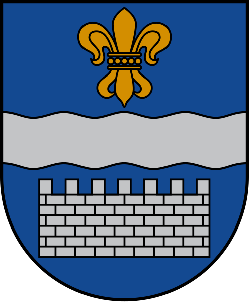    | 1940                           | 77 799                    | 72,4        | Sadarbība ar [Augšdaugavas novadu](https://lv.wikipedia.org/wiki/Aug%C5%A1daugavas_novads "Augšdaugavas novads")   |
| [Jēkabpils](https://lv.wikipedia.org/wiki/J%C4%93kabpils "Jēkabpils") |      | 2009                           | 21 150                    | 25,5        | [Jēkabpils novads](https://lv.wikipedia.org/wiki/J%C4%93kabpils_novads "Jēkabpils novads")                               |
| [Jelgava](https://lv.wikipedia.org/wiki/Jelgava "Jelgava")            |      | 1940                           | 54 701                    | 60,6        | Sadarbība ar [Jelgavas novadu](https://lv.wikipedia.org/wiki/Jelgavas_novads "Jelgavas novads")                          |
| [Jūrmala](https://lv.wikipedia.org/wiki/J%C5%ABrmala "Jūrmala")       |         | 1959                           | 52 154                    | 101,2       | **—**                                                                                                                    |
| [Liepāja](https://lv.wikipedia.org/wiki/Liep%C4%81ja "Liepāja")       | 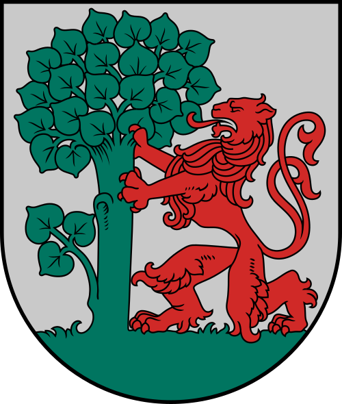         | 1940                           | 66 680                    | 68,0        | Sadarbība ar [Dienvidkurzemes novadu](https://lv.wikipedia.org/wiki/Dienvidkurzemes_novads "Dienvidkurzemes novads")     |
| [Ogre](https://lv.wikipedia.org/wiki/Ogre "Ogre")                     |             | 2021                           | 22 767                    | 16,2        | [Ogres novads](https://lv.wikipedia.org/wiki/Ogres_novads "Ogres novads")                                                |
| [Rēzekne](https://lv.wikipedia.org/wiki/R%C4%93zekne "Rēzekne")       | 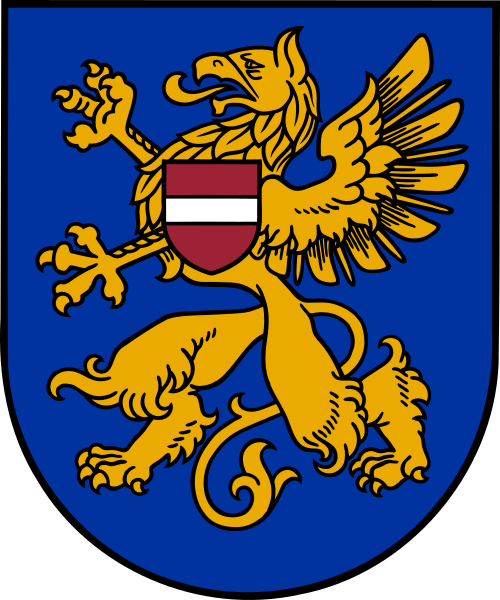         | 1952                           | 26 131                    | 17,5        | Sadarbība ar [Rēzeknes novadu](https://lv.wikipedia.org/wiki/R%C4%93zeknes_novads "Rēzeknes novads")                     |
| [Rīga](https://lv.wikipedia.org/wiki/R%C4%ABga "Rīga")                |             | 1931                           | 605 273                   | 304,0       | **—**                                                                                                                    |
| [Valmiera](https://lv.wikipedia.org/wiki/Valmiera "Valmiera")         | 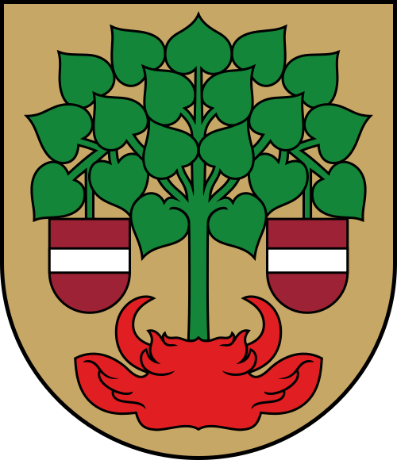       | 2009                           | 22 376                    | 19,4        | [Valmieras novads](https://lv.wikipedia.org/wiki/Valmieras_novads "Valmieras novads")                                    |
| [Ventspils](https://lv.wikipedia.org/wiki/Ventspils "Ventspils")      |  | 1940                           | 32 634                    | 58,0        | Sadarbība ar [Ventspils novadu](https://lv.wikipedia.org/wiki/Ventspils_novads "Ventspils novads")                       |

## Объяснение терминов

1. **Novads** – Это крупная административная единица в Латвии, схожая с областями или регионами в других странах. **Novadi** включают в себя несколько городов и волостей (pagasti), а также другие более мелкие населённые пункты. Пример: **Kuldīgas novads** есть Kuldīgas pilsēta и Scrunda, а также Alsungas pagasts, в котором можно найти Alsunga (центр) и Reģi (ciems).

2. **Pagasts (Волость)** = Это административная единица ниже уровня **novads**, которая обычно включает сельские территории или небольшие поселения. **Pagasts** аналогичен муниципальным районам или сельским округам в других странах. 

3. **Pilsēta (Город)** – Это самостоятельная административная единица, которая может быть частью **novads** или действовать как отдельная административная единица. Крупные города, такие как Рига или Лиепая, имеют свой административный статус.

4. **Pilsētas novads (Городской район)** – Это район, который включает в себя как городские, так и пригородные территории. Такие районы включают один крупный город и прилегающие к нему территории.
## Novadi un to teritoriālā iedalījuma vienības

| Novads                                                                                                  | Ģerbonis                        | Centrs                                                                     | Iedzīvotāju   skaits (2024) | Platība km2 |
| ------------------------------------------------------------------------------------------------------- | ------------------------------- | -------------------------------------------------------------------------- | ------------------------------ | ----------- |
| [Ādažu novads](https://lv.wikipedia.org/wiki/%C4%80da%C5%BEu_novads "Ādažu novads")                     |                | [Ādaži](https://lv.wikipedia.org/wiki/%C4%80da%C5%BEi "Ādaži")             | 23 281                         | 242,9       |
| [Aizkraukles novads](https://lv.wikipedia.org/wiki/Aizkraukles_novads "Aizkraukles novads")             | 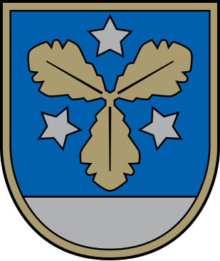       | [Aizkraukle](https://lv.wikipedia.org/wiki/Aizkraukle "Aizkraukle")        | 28 618                         | 2274,3      |
| [Alūksnes novads](https://lv.wikipedia.org/wiki/Al%C5%ABksnes_novads "Alūksnes novads")                 |              | [Alūksne](https://lv.wikipedia.org/wiki/Al%C5%ABksne "Alūksne")            | 13 059                         | 1699,8      |
| [Augšdaugavas novads](https://lv.wikipedia.org/wiki/Aug%C5%A1daugavas_novads "Augšdaugavas novads")     |  | [Daugavpils](https://lv.wikipedia.org/wiki/Daugavpils "Daugavpils")        | 24 361                         | 2523,6      |
| [Balvu novads](https://lv.wikipedia.org/wiki/Balvu_novads "Balvu novads")                               |              | [Balvi](https://lv.wikipedia.org/wiki/Balvi "Balvi")                       | 17 910                         | 2386,3      |
| [Bauskas novads](https://lv.wikipedia.org/wiki/Bauskas_novads "Bauskas novads")                         |          | [Bauska](https://lv.wikipedia.org/wiki/Bauska "Bauska")                    | 40 906                         | 2174,9      |
| [Cēsu novads](https://lv.wikipedia.org/wiki/C%C4%93su_novads "Cēsu novads")                             | 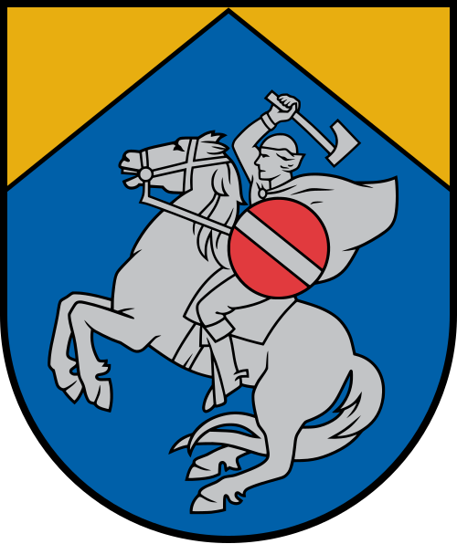               | [Cēsis](https://lv.wikipedia.org/wiki/C%C4%93sis "Cēsis")                  | 40 943                         | 2668,2      |
| [Dienvidkurzemes novads](https://lv.wikipedia.org/wiki/Dienvidkurzemes_novads "Dienvidkurzemes novads") |    | [Grobiņa](https://lv.wikipedia.org/wiki/Grobi%C5%86a "Grobiņa")            | 32 708                         | 3629,5      |
| [Dobeles novads](https://lv.wikipedia.org/wiki/Dobeles_novads "Dobeles novads")                         |          | [Dobele](https://lv.wikipedia.org/wiki/Dobele "Dobele")                    | 27 474                         | 1629,4      |
| [Gulbenes novads](https://lv.wikipedia.org/wiki/Gulbenes_novads "Gulbenes novads")                      |        | [Gulbene](https://lv.wikipedia.org/wiki/Gulbene "Gulbene")                 | 18 740                         | 1876,1      |
| [Jēkabpils novads](https://lv.wikipedia.org/wiki/J%C4%93kabpils_novads "Jēkabpils novads")              |      | [Jēkabpils](https://lv.wikipedia.org/wiki/J%C4%93kabpils "Jēkabpils")      | 39 276                         | 2996,1      |
| [Jelgavas novads](https://lv.wikipedia.org/wiki/Jelgavas_novads "Jelgavas novads")                      |        | [Jelgava](https://lv.wikipedia.org/wiki/Jelgava "Jelgava")                 | 32 053                         | 1604,1      |
| [Krāslavas novads](https://lv.wikipedia.org/wiki/Kr%C4%81slavas_novads "Krāslavas novads")              |        | [Krāslava](https://lv.wikipedia.org/wiki/Kr%C4%81slava "Krāslava")         | 19 833                         | 2288,9      |
| [Kuldīgas novads](https://lv.wikipedia.org/wiki/Kuld%C4%ABgas_novads "Kuldīgas novads")                 | 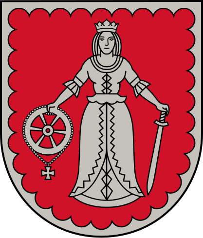         | [Kuldīga](https://lv.wikipedia.org/wiki/Kuld%C4%ABga "Kuldīga")            | 26 956                         | 2505,2      |
| [Ķekavas novads](https://lv.wikipedia.org/wiki/%C4%B6ekavas_novads "Ķekavas novads")                    |          | [Ķekava](https://lv.wikipedia.org/wiki/%C4%B6ekava "Ķekava")               | 31 303                         | 454,5       |
| [Limbažu novads](https://lv.wikipedia.org/wiki/Limba%C5%BEu_novads "Limbažu novads")                    | 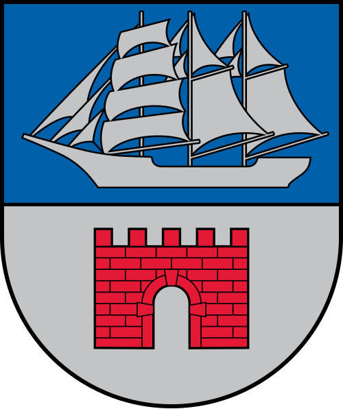         | [Limbaži](https://lv.wikipedia.org/wiki/Limba%C5%BEi "Limbaži")            | 27 852                         | 2440,8      |
| [Līvānu novads](https://lv.wikipedia.org/wiki/L%C4%ABv%C4%81nu_novads "Līvānu novads")                  |            | [Līvāni](https://lv.wikipedia.org/wiki/L%C4%ABv%C4%81ni "Līvāni")          | 10 215                         | 624,6       |
| [Ludzas novads](https://lv.wikipedia.org/wiki/Ludzas_novads "Ludzas novads")                            |            | [Ludza](https://lv.wikipedia.org/wiki/Ludza "Ludza")                       | 20 745                         | 2411,4      |
| [Madonas novads](https://lv.wikipedia.org/wiki/Madonas_novads "Madonas novads")                         |            | [Madona](https://lv.wikipedia.org/wiki/Madona "Madona")                    | 27 255                         | 3354,8      |
| [Mārupes novads](https://lv.wikipedia.org/wiki/M%C4%81rupes_novads "Mārupes novads")                    |          | [Mārupe](https://lv.wikipedia.org/wiki/M%C4%81rupe "Mārupe")               | 37 025                         | 347,2       |
| [Ogres novads](https://lv.wikipedia.org/wiki/Ogres_novads "Ogres novads")                               | 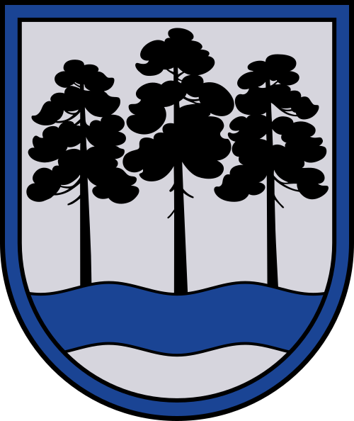               | [Ogre](https://lv.wikipedia.org/wiki/Ogre "Ogre")                          | 57 689                         | 1839,4      |
| [Olaines novads](https://lv.wikipedia.org/wiki/Olaines_novads "Olaines novads")                         | 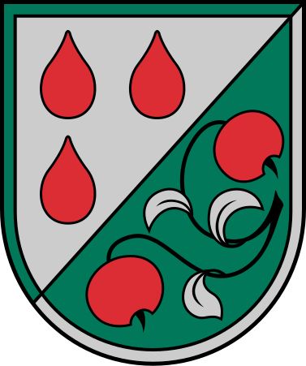          | [Olaine](https://lv.wikipedia.org/wiki/Olaine "Olaine")                    | 20 658                         | 297,0       |
| [Preiļu novads](https://lv.wikipedia.org/wiki/Prei%C4%BCu_novads "Preiļu novads")                       |            | [Preiļi](https://lv.wikipedia.org/wiki/Prei%C4%BCi "Preiļi")               | 15 768                         | 1419,4      |
| [Rēzeknes novads](https://lv.wikipedia.org/wiki/R%C4%93zeknes_novads "Rēzeknes novads")                 | 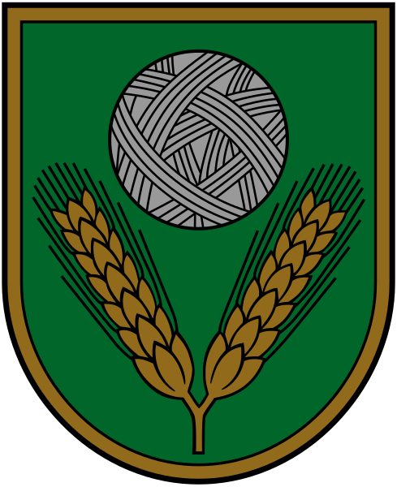       | [Rēzekne](https://lv.wikipedia.org/wiki/R%C4%93zekne "Rēzekne")            | 28 305                         | 3088,9      |
| [Ropažu novads](https://lv.wikipedia.org/wiki/Ropa%C5%BEu_novads "Ropažu novads")                       | 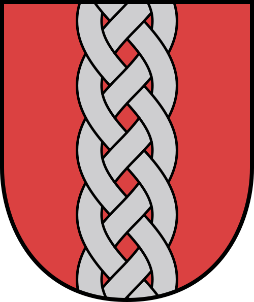           | [Ulbroka](https://lv.wikipedia.org/wiki/Ulbroka "Ulbroka")                 | 35 178                         | 536,0       |
| [Salaspils novads](https://lv.wikipedia.org/wiki/Salaspils_novads "Salaspils novads")                   |      | [Salaspils](https://lv.wikipedia.org/wiki/Salaspils "Salaspils")           | 23 694                         | 127,0       |
| [Saldus novads](https://lv.wikipedia.org/wiki/Saldus_novads "Saldus novads")                            | 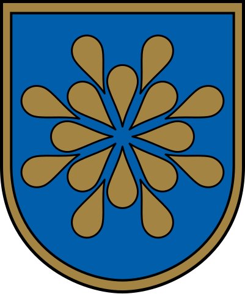           | [Saldus](https://lv.wikipedia.org/wiki/Saldus "Saldus")                    | 26 320                         | 2179,5      |
| [Saulkrastu novads](https://lv.wikipedia.org/wiki/Saulkrastu_novads "Saulkrastu novads")                |    | [Saulkrasti](https://lv.wikipedia.org/wiki/Saulkrasti "Saulkrasti")        | 9926                           | 277,8       |
| [Siguldas novads](https://lv.wikipedia.org/wiki/Siguldas_novads "Siguldas novads")                      |          | [Sigulda](https://lv.wikipedia.org/wiki/Sigulda "Sigulda")                 | 31 469                         | 1030,1      |
| [Smiltenes novads](https://lv.wikipedia.org/wiki/Smiltenes_novads "Smiltenes novads")                   |        | [Smiltene](https://lv.wikipedia.org/wiki/Smiltene "Smiltene")              | 17 697                         | 1801,3      |
| [Talsu novads](https://lv.wikipedia.org/wiki/Talsu_novads "Talsu novads")                               | 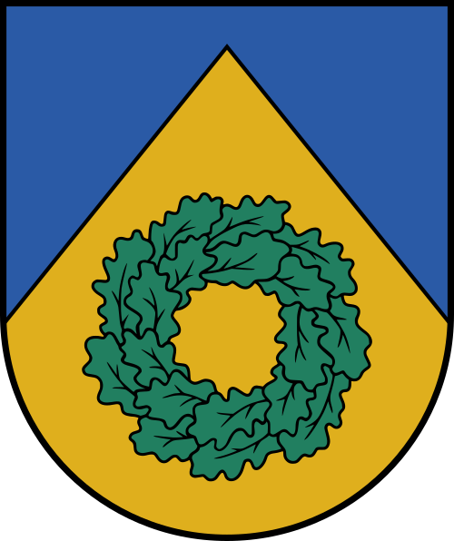             | [Talsi](https://lv.wikipedia.org/wiki/Talsi "Talsi")                       | 34 675                         | 2744,0      |
| [Tukuma novads](https://lv.wikipedia.org/wiki/Tukuma_novads "Tukuma novads")                            |            | [Tukums](https://lv.wikipedia.org/wiki/Tukums "Tukums")                    | 43 641                         | 2450,0      |
| [Valkas novads](https://lv.wikipedia.org/wiki/Valkas_novads "Valkas novads")                            |              | [Valka](https://lv.wikipedia.org/wiki/Valka "Valka")                       | 7501                           | 908,0       |
| [Valmieras novads](https://lv.wikipedia.org/wiki/Valmieras_novads "Valmieras novads")                   | 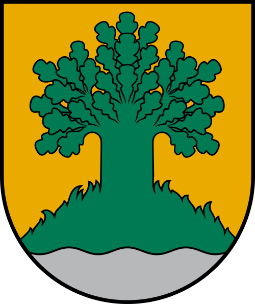       | [Valmiera](https://lv.wikipedia.org/wiki/Valmiera "Valmiera")              | 50 283                         | 2946,0      |
| [Varakļānu novads](https://lv.wikipedia.org/wiki/Varak%C4%BC%C4%81nu_novads "Varakļānu novads")         |      | [Varakļāni](https://lv.wikipedia.org/wiki/Varak%C4%BC%C4%81ni "Varakļāni") | 2890                           | 279,0       |
| [Ventspils novads](https://lv.wikipedia.org/wiki/Ventspils_novads "Ventspils novads")                   |   | [Ventspils](https://lv.wikipedia.org/wiki/Ventspils "Ventspils")           | 10 303                         | 2472,0      |

## Vēsturiskās zemes
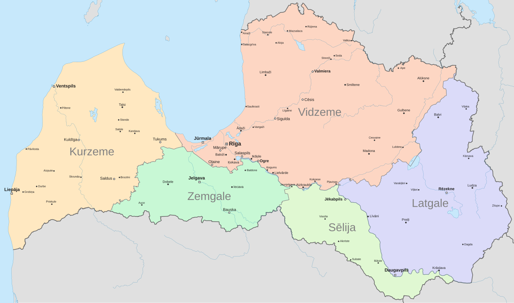

### Simboli

| Novads                                                       | Ģerbonis                                                                                                                                                                                                             | Karogs                                                                                                                                                                                                       |
| ------------------------------------------------------------ | -------------------------------------------------------------------------------------------------------------------------------------------------------------------------------------------------------------------- | ------------------------------------------------------------------------------------------------------------------------------------------------------------------------------------------------------------ |
| [Kurzeme](https://lv.wikipedia.org/wiki/Kurzeme "Kurzeme")   |              | _nav_                                                                                                                                                                                                        |
| [Latgale](https://lv.wikipedia.org/wiki/Latgale "Latgale")   |              |  |
| [Sēlija](https://lv.wikipedia.org/wiki/S%C4%93lija "Sēlija") |  |                 |
| [Vidzeme](https://lv.wikipedia.org/wiki/Vidzeme "Vidzeme")   |              | _nav_                                                                                                                                                                                                        |
| [Zemgale](https://lv.wikipedia.org/wiki/Zemgale "Zemgale")   |              |  |

