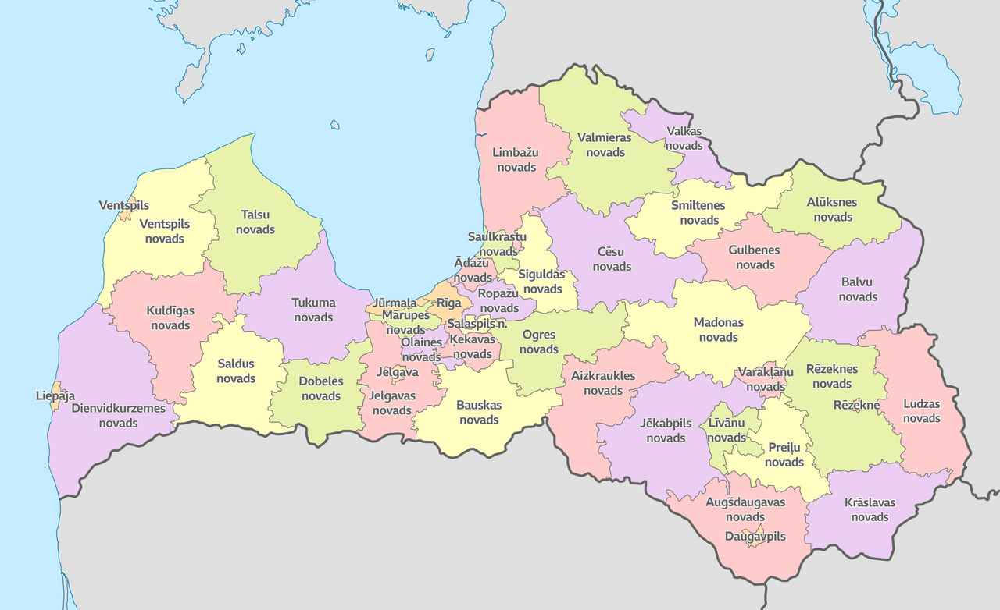

## Державні міста

| Mістo                                                                | Герб                        | Статус | Населення (2024) |
| -------------------------------------------------------------------- | --------------------------- | ------ | ---------------- |
| [Даугавпілс](https://lv.wikipedia.org/wiki/Daugavpils "Daugavpils")  | 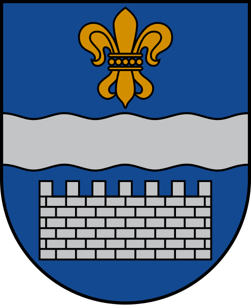   | 1940   | 77 799           |
| [Єкабпілс](https://lv.wikipedia.org/wiki/J%C4%93kabpils "Jēkabpils") | 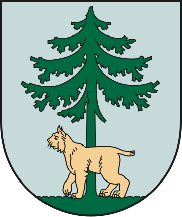     | 2009   | 21 150           |
| [Єлгава](https://lv.wikipedia.org/wiki/Jelgava "Jelgava")            | 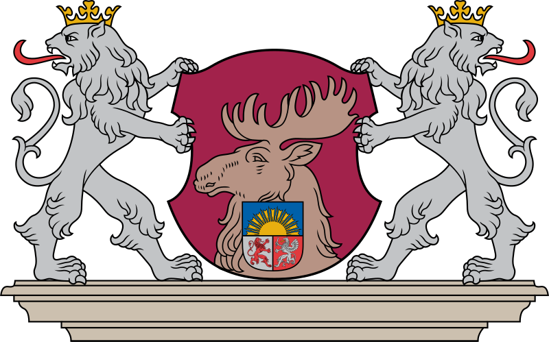     | 1940   | 54 701           |
| [Юрмала](https://lv.wikipedia.org/wiki/J%C5%ABrmala "Jūrmala")       |         | 1959   | 52 154           |
| [Лієпая](https://lv.wikipedia.org/wiki/Liep%C4%81ja "Liepāja")       | 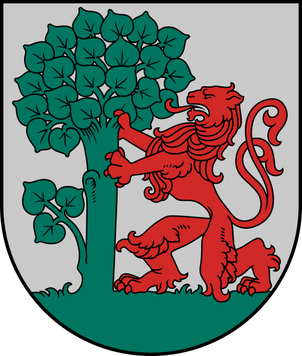         | 1940   | 66 680           |
| [Огре](https://lv.wikipedia.org/wiki/Ogre "Ogre")                    | 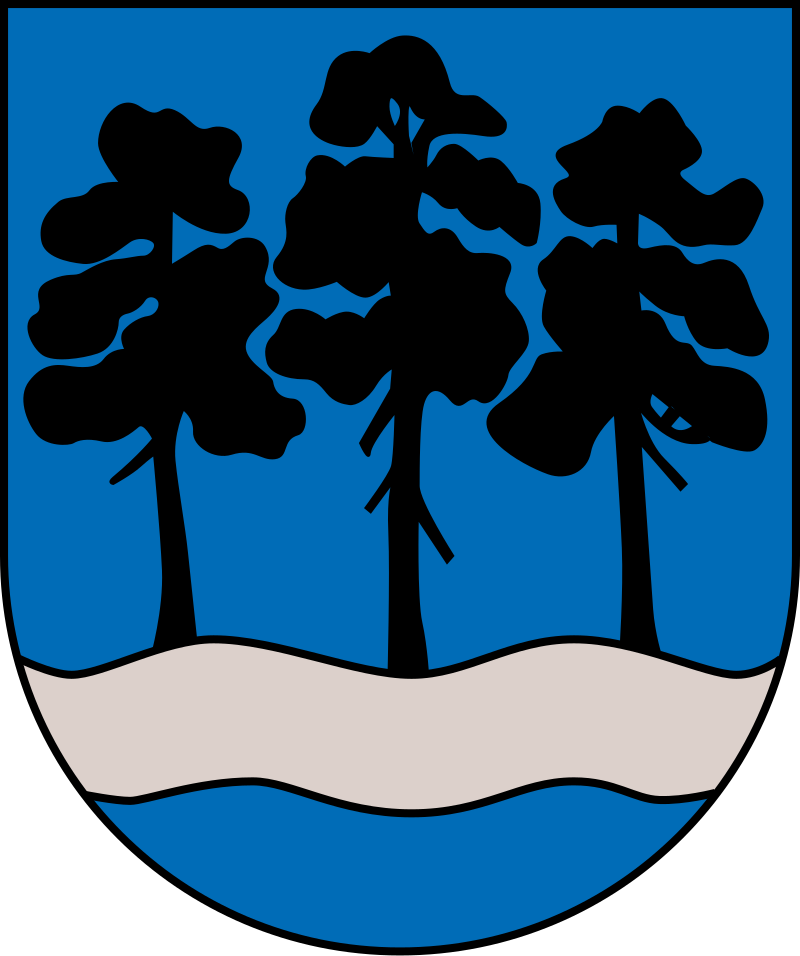            | 2021   | 22 767           |
| [Резекне](https://lv.wikipedia.org/wiki/R%C4%93zekne "Rēzekne")      | 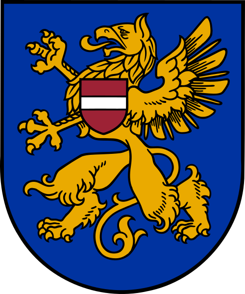         | 1952   | 26 131           |
| [Рига](https://lv.wikipedia.org/wiki/R%C4%ABga "Rīga")               | 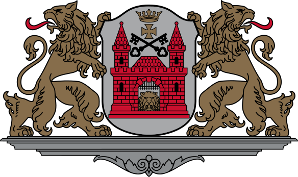            | 1931   | 605 273          |
| [Валміера](https://lv.wikipedia.org/wiki/Valmiera "Valmiera")        | 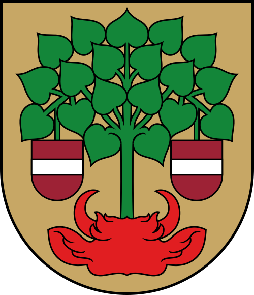       | 2009   | 22 376           |
| [Вентспілс](https://lv.wikipedia.org/wiki/Ventspils "Ventspils")     |  | 1940   | 32 634           |

## Пояснення термінів

- **Novads** – це велика адміністративна одиниця в Латвії, схожа на області чи регіони в інших країнах. **Novadi** включають кілька міст і волостей (pagasti), а також інші менші населені пункти. Наприклад, **Kuldīgas novads** складається з міста Кулдіга і Скрунда, а також волості Алсунга, де знаходяться Алсунга (центр) і Регі (село).

- **Pagasts** – це адміністративна одиниця нижче рівня **novads**, яка зазвичай охоплює сільські території або невеликі поселення. **Pagasts** схожий на муніципальні райони або сільські округи в інших країнах.

- **Pilsēta** – це окрема адміністративна одиниця, яка може бути частиною **novads** або функціонувати як самостійна адміністративна одиниця. Великі міста, такі як Рига чи Лієпая, мають свій адміністративний статус.

- **Pilsētas novads** – це район, який охоплює як міські, так і приміські території. Такі райони включають одне велике місто та прилеглі до нього території.
## Novadi

| Novads                                                                                               | Ģerbonis                        | Pilsetas                                                                                                                  | Iedzīvotāju  skaits (2024) |
| ---------------------------------------------------------------------------------------------------- | ------------------------------- | ------------------------------------------------------------------------------------------------------------------------- | -------------------------- |
| [Адазький](https://lv.wikipedia.org/wiki/%C4%80da%C5%BEu_novads "Ādažu novads")                      | 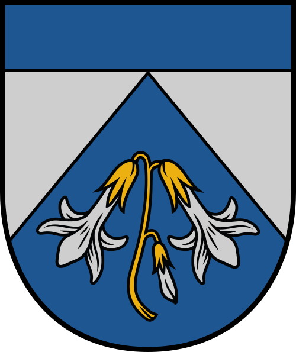               | [Ādaži](https://lv.wikipedia.org/wiki/%C4%80da%C5%BEi "Ādaži")                                                      | 23 281                     |
| [Айзкраукленський](https://lv.wikipedia.org/wiki/Aizkraukles_novads "Aizkraukles novads")            | 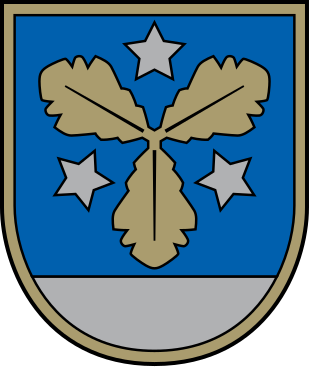       | [Aizkraukle](https://lv.wikipedia.org/wiki/Aizkraukle "Aizkraukle") Jaunjelgava Koknese Pļaviņas     | 28 618                     |
| [Алуксненський](https://lv.wikipedia.org/wiki/Al%C5%ABksnes_novads "Alūksnes novads")                |              | [Alūksne](https://lv.wikipedia.org/wiki/Al%C5%ABksne "Alūksne")                                                           | 13 059                     |
| [Аугшдаугавський](https://lv.wikipedia.org/wiki/Aug%C5%A1daugavas_novads "Augšdaugavas novads")      |  | [Daugavpils](https://lv.wikipedia.org/wiki/Daugavpils "Daugavpils") Ilūkste Subate                               | 24 361                     |
| [Балвський](https://lv.wikipedia.org/wiki/Balvu_novads "Balvu novads")                               | 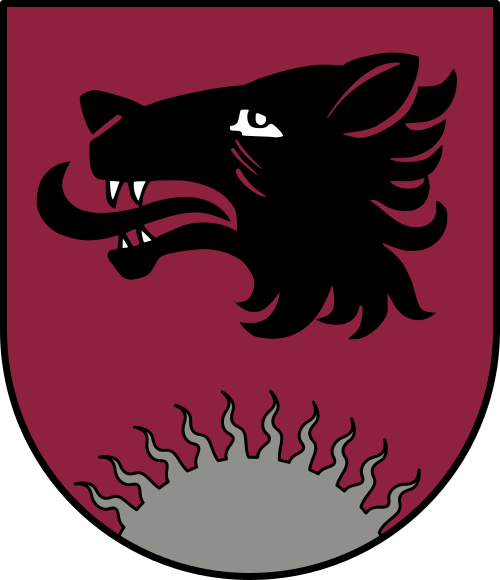             | [Balvi](https://lv.wikipedia.org/wiki/Balvi)   Viļaka                                       | 17 910                     |
| [Бауський](https://lv.wikipedia.org/wiki/Bauskas_novads "Bauskas novads")                            |          | [Bauska](https://lv.wikipedia.org/wiki/Bauska)   Iecava                                        | 40 906                     |
| [Цесіський](https://lv.wikipedia.org/wiki/C%C4%93su_novads "Cēsu novads")                            | 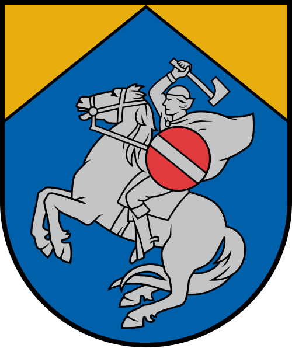               | [Cēsis](https://lv.wikipedia.org/wiki/C%C4%93sis "Cēsis") Līgatne                                                      | 40 943                     |
| [Південнокурземський](https://lv.wikipedia.org/wiki/Dienvidkurzemes_novads "Dienvidkurzemes novads") | 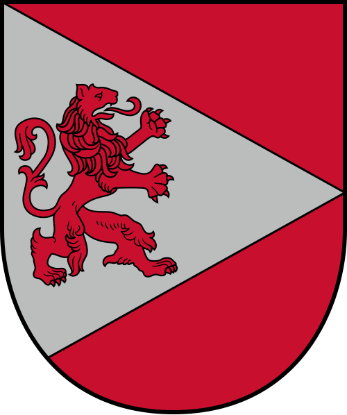   | [Grobiņa](https://lv.wikipedia.org/wiki/Grobi%C5%86a "Grobiņa") Aizpute Durbe Pāvilosta Priekule              | 32 708                     |
| [Добельський](https://lv.wikipedia.org/wiki/Dobeles_novads "Dobeles novads")                         | 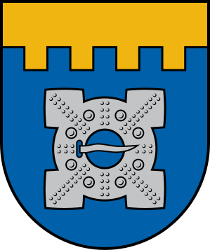         | [*Dobele*](https://lv.wikipedia.org/wiki/Dobele "Dobele") Auce                                                         | 27 474                     |
| [Гулбенський](https://lv.wikipedia.org/wiki/Gulbenes_novads "Gulbenes novads")                       |        | [Gulbene](https://lv.wikipedia.org/wiki/Gulbene)                                                                          | 18 740                     |
| [Єкабпільський](https://lv.wikipedia.org/wiki/J%C4%93kabpils_novads "Jēkabpils novads")              |      | [Jēkabpils](https://lv.wikipedia.org/wiki/J%C4%93kabpils) Aknīste Viesīte                         | 39 276                     |
| [Єлгавський](https://lv.wikipedia.org/wiki/Jelgavas_novads "Jelgavas novads")                        |        | [Jelgava](https://lv.wikipedia.org/wiki/Jelgava)                                                                          | 32 053                     |
| [Краславський](https://lv.wikipedia.org/wiki/Kr%C4%81slavas_novads "Krāslavas novads")               | 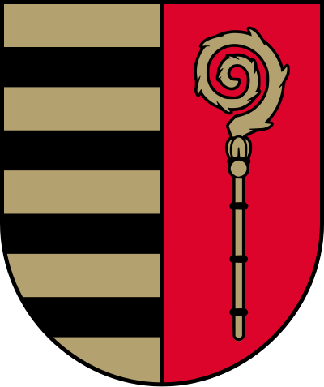       | [*Krāslava*](https://lv.wikipedia.org/wiki/Kr%C4%81slava "Krāslava") Dagda                                             | 19 833                     |
| [Кулдизький](https://lv.wikipedia.org/wiki/Kuld%C4%ABgas_novads "Kuldīgas novads")                   | 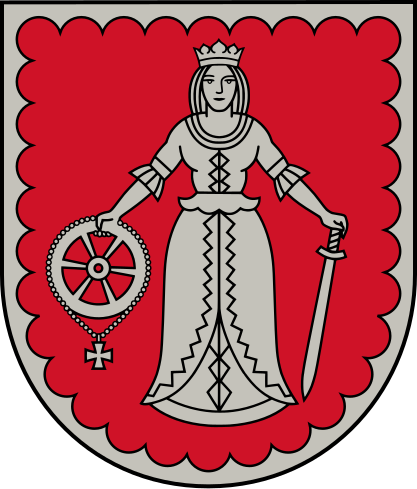         | [*Kuldīga*](https://lv.wikipedia.org/wiki/Kuld%C4%ABga "Kuldīga") Skrunda                                              | 26 956                     |
| [Кекавський](https://lv.wikipedia.org/wiki/%C4%B6ekavas_novads "Ķekavas novads")                     |          | [Ķekava](https://lv.wikipedia.org/wiki/%C4%B6ekava "Ķekava") Baldone Baloži                                      | 31 303                     |
| [Лимбазький](https://lv.wikipedia.org/wiki/Limba%C5%BEu_novads "Limbažu novads")                     | 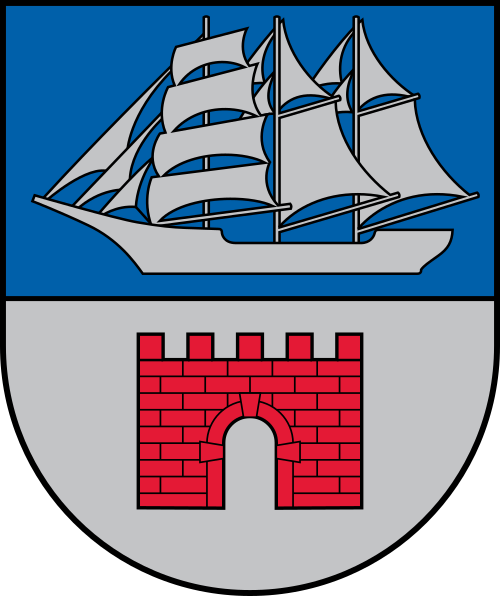         | [Limbaži](https://lv.wikipedia.org/wiki/Limba%C5%BEi "Limbaži") Ainaži Aloja Limbaži Salacgrīva Staicele   | 27 852                     |
| [Ливанський](https://lv.wikipedia.org/wiki/L%C4%ABv%C4%81nu_novads "Līvānu novads")                  | 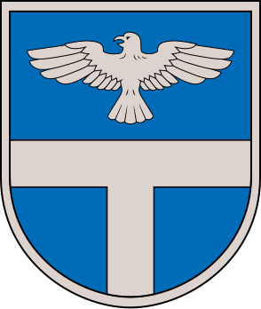           | [Līvāni](https://lv.wikipedia.org/wiki/L%C4%ABv%C4%81ni)                                                                  | 10 215                     |
| [Лудзенський](https://lv.wikipedia.org/wiki/Ludzas_novads "Ludzas novads")                           | 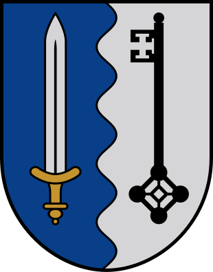           | [Ludza](https://lv.wikipedia.org/wiki/Ludza) Kārsava Zilupe                                                         | 20 745                     |
| [Мадонський](https://lv.wikipedia.org/wiki/Madonas_novads "Madonas novads")                          | 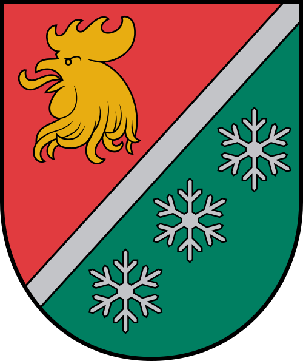           | [Madona](https://lv.wikipedia.org/wiki/Madona "Madona") Cesvaine Lubāna                                             | 27 255                     |
| [Марупський](https://lv.wikipedia.org/wiki/M%C4%81rupes_novads "Mārupes novads")                     |          | [Mārupe](https://lv.wikipedia.org/wiki/M%C4%81rupe "Mārupe")                                                              | 37 025                     |
| [Огрський](https://lv.wikipedia.org/wiki/Ogres_novads "Ogres novads")                                | 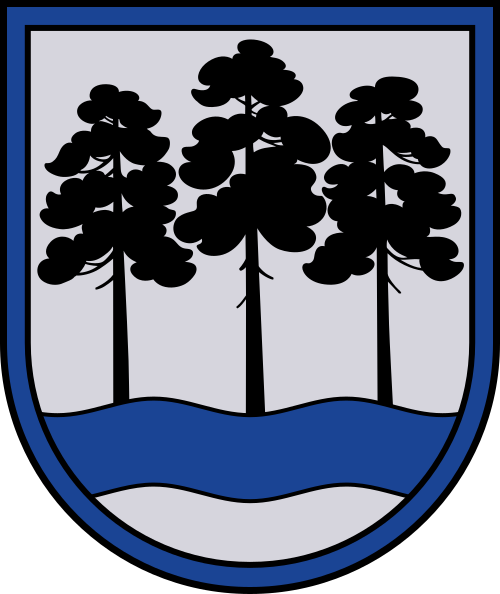               | [Ogre](https://lv.wikipedia.org/wiki/Ogre) Ikšķile Ķegums Lielvārde                                              | 57 689                     |
| [Олайнський](https://lv.wikipedia.org/wiki/Olaines_novads "Olaines novads")                          | 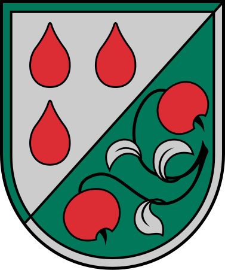          | [Olaine](https://lv.wikipedia.org/wiki/Olaine)                                                                            | 20 658                     |
| [Прейльський](https://lv.wikipedia.org/wiki/Prei%C4%BCu_novads "Preiļu novads")                      | 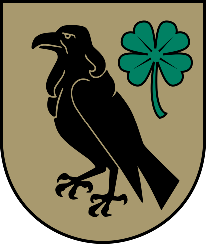           | [Preiļi](https://lv.wikipedia.org/wiki/Prei%C4%BCi)                                                                       | 15 768                     |
| [Резекненський](https://lv.wikipedia.org/wiki/R%C4%93zeknes_novads "Rēzeknes novads")                | 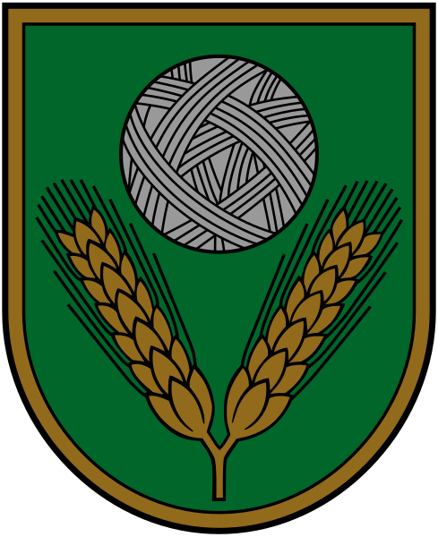       | [Rēzekne](https://lv.wikipedia.org/wiki/R%C4%93zekne) Viļāni                                                           | 28 305                     |
| [Ропазький](https://lv.wikipedia.org/wiki/Ropa%C5%BEu_novads "Ropažu novads")                        | 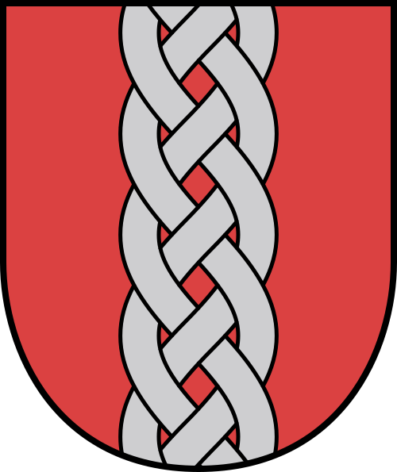           | [Ulbroka](https://lv.wikipedia.org/wiki/Ulbroka "Ulbroka") Vangaži                                                     | 35 178                     |
| [Саласпільський](https://lv.wikipedia.org/wiki/Salaspils_novads "Salaspils novads")                  | 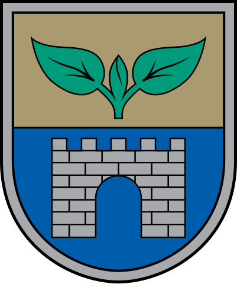     | [Salaspils](https://lv.wikipedia.org/wiki/Salaspils "Salaspils")                                                          | 23 694                     |
| [Салдуський](https://lv.wikipedia.org/wiki/Saldus_novads "Saldus novads")                            | 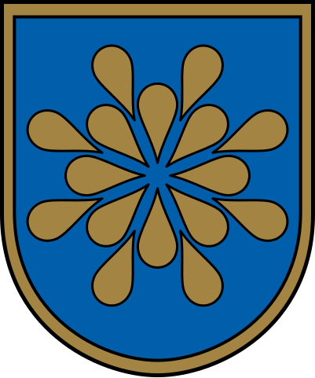           | [Saldus](https://lv.wikipedia.org/wiki/Saldus "Saldus") Brocēni                                                        | 26 320                     |
| [Саулкрастський](https://lv.wikipedia.org/wiki/Saulkrastu_novads "Saulkrastu novads")                | 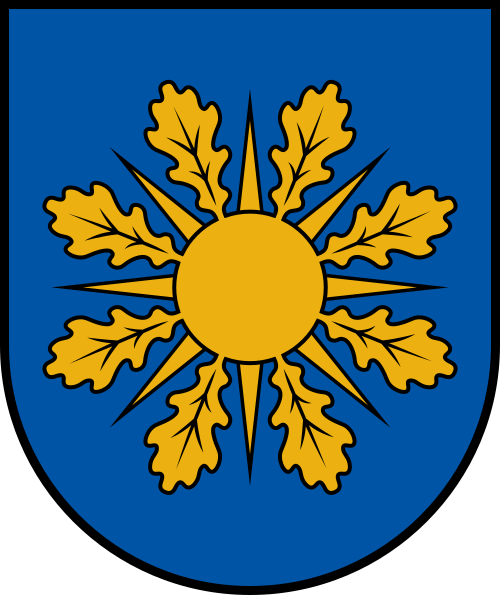   | [Saulkrasti](https://lv.wikipedia.org/wiki/Saulkrasti "Saulkrasti")                                                       | 9926                       |
| [Сігулдський](https://lv.wikipedia.org/wiki/Siguldas_novads "Siguldas novads")                       | 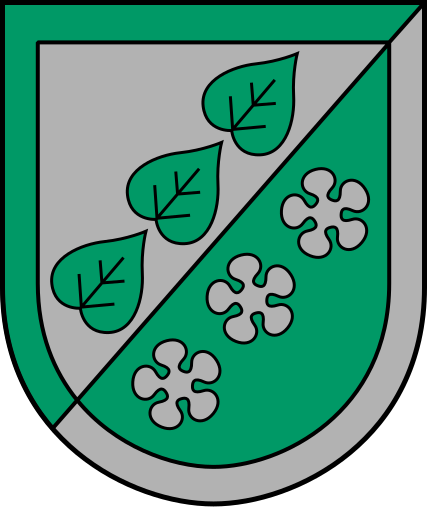         | [Sigulda](https://lv.wikipedia.org/wiki/Sigulda "Sigulda")                                                             | 31 469                     |
| [Смілтенський](https://lv.wikipedia.org/wiki/Smiltenes_novads "Smiltenes novads")                    |        | [Smiltene](https://lv.wikipedia.org/wiki/Smiltene "Smiltene") Ape                                                      | 17 697                     |
| [Талсинський](https://lv.wikipedia.org/wiki/Talsu_novads "Talsu novads")                             | 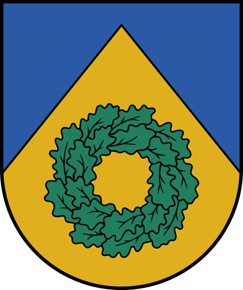             | [Talsi](https://lv.wikipedia.org/wiki/Talsi) Sabile Stende Valdemārpils                                          | 34 675                     |
| [Тукумський](https://lv.wikipedia.org/wiki/Tukuma_novads "Tukuma novads")                            |            | [Tukums](https://lv.wikipedia.org/wiki/Tukums) Kandava                                                                 | 43 641                     |
| [Валкський](https://lv.wikipedia.org/wiki/Valkas_novads "Valkas novads")                             | 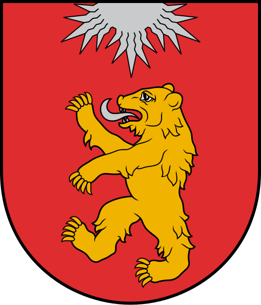             | [Valka](https://lv.wikipedia.org/wiki/Valka)                                                                              | 7501                       |
| [Валміерський](https://lv.wikipedia.org/wiki/Valmieras_novads "Valmieras novads")                    | 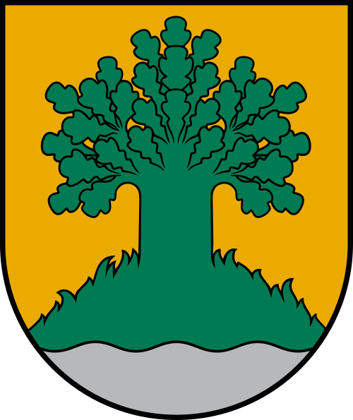       | [Valmiera](https://lv.wikipedia.org/wiki/Valmiera "Valmiera") Mazsalaca Rūjiena Seda Strenči                  | 50 283                     |
| [Вараклянський](https://lv.wikipedia.org/wiki/Varak%C4%BC%C4%81nu_novads "Varakļānu novads")         | 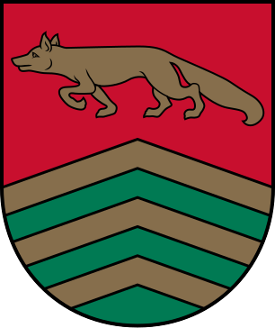     | [Varakļāni](https://lv.wikipedia.org/wiki/Varak%C4%BC%C4%81ni "Varakļāni")                                             | 2890                       |
| [Вентспілський](https://lv.wikipedia.org/wiki/Ventspils_novads "Ventspils novads")                   | 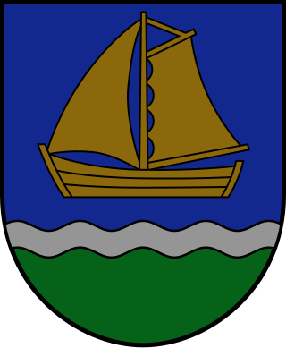  | [Ventspils](https://lv.wikipedia.org/wiki/Ventspils) Piltene                                                           | 10 303                     |

## iсторичні землі
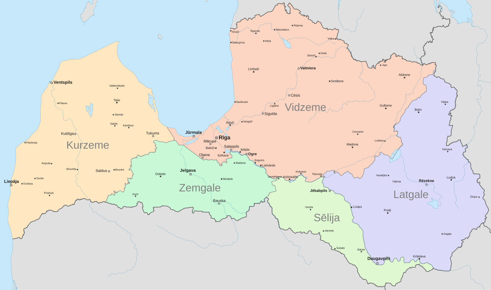

| Novads                                                       | Ģerbonis                                                                                                                                                                                                             | Karogs                                                                                                                                                                                                       |
| ------------------------------------------------------------ | -------------------------------------------------------------------------------------------------------------------------------------------------------------------------------------------------------------------- | ------------------------------------------------------------------------------------------------------------------------------------------------------------------------------------------------------------ |
| [Kurzeme](https://lv.wikipedia.org/wiki/Kurzeme "Kurzeme")   |              | _nav_                                                                                                                                                                                                        |
| [Latgale](https://lv.wikipedia.org/wiki/Latgale "Latgale")   |              |  |
| [Sēlija](https://lv.wikipedia.org/wiki/S%C4%93lija "Sēlija") |  |                 |
| [Vidzeme](https://lv.wikipedia.org/wiki/Vidzeme "Vidzeme")   |              | _nav_                                                                                                                                                                                                        |
| [Zemgale](https://lv.wikipedia.org/wiki/Zemgale "Zemgale")   |              |  |

