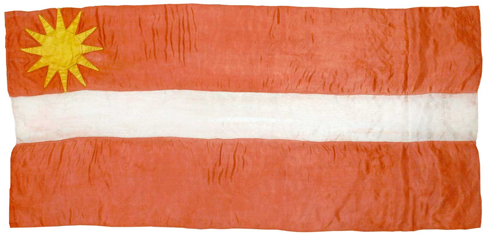

Латвійський прапор має кармінно-червоний колір з горизонтальною білою смугою посередині. Він був створений у 19 столітті на основі опису давнього летвійського або латгальського прапора в Хроніці подій, що робить його одним із найстаріших національних прапорів, які досі використовуються.

Унікальний кармінний колір прапора вперше був офіційно описаний у державному документі в 1922 році, щоб відрізнити його від схожого австрійського національного прапора.

Після окупації Латвії в 1940 році використання або зберігання цього прапора було кримінально караним. Прапор знову з'явився на публіці в кінці 1980-х років, широко використовувався під час руху «Пробудження», і його статус національного прапора був відновлений 27 лютого 1990 року.

## Передісторія та інтерпретація

- Дві кармінно-червоні смуги символізують кров, пролиту латвійськими солдатами протягом століть за свободу свого народу.
- Біла смуга посередині означає честь, справедливість і гідність латвійців, а також їхні права та закони.

Символ латвійської держави має багатий історичний контекст, відомий майже 800 років. Перші письмові свідчення про нього датуються 13 століттям. Прапор згадується в Лівонській хроніці як один із прапорів балтійських народів.

Згідно з легендою, в одній із запеклих битв латвійський командир був важко поранений і сильно стікав кров'ю. Його винесли з поля бою на білій тканині, яка забарвилася в червоний колір від його крові. Тільки середня смуга залишилася білою, де лежав командир, який згодом помер від тяжких ран. Солдати, обурені своєю втратою, прагнули помститися за смерть свого вождя. Вони підняли цю тканину як прапор і, з новими силами, пішли в бій, де здобули перемогу. З тих пір червоно-біло-червоний прапор вважається національним символом Латвії.

Згідно з іншою версією події, кров загиблих ворогів збирали в великому котлі, куди занурювали білу тканину, прив'язану до списа. Таким чином, вся тканина була забарвлена в кроваво-червоний колір, за винятком місця, де вона була прикріплена. Цей прапор служив для залякування противників під час боїв.

> У 1870 році латвійські студенти знайшли опис червоно-біло-червоного прапора в давніх хроніках і вирішили прийняти його як національний символ.

Перший латвійський народний прапор з тканини виготовив звичайний учитель Яніс Лапіньш. Ескіз прапора прийшов до нього разом із думками про незалежність латвійського народу. Сам прапор зшила наречена Яніса — Марианна Страумане в 1916 році.

Цесісський музей історії та мистецтв зберіг перший варіант прапора. Його вибір не був випадковим. По-перше, Цесіс — рідне місто Яніса. По-друге, в Лівонській хроніці подій 1279 року говориться, що солдати з червоно-біло-червоним прапором прийшли з Цесісу.

В різних регіонах Латвії прапор, придуманий Янісом, зазнав змін:

- додали зображення серця, проткнутого мечем, різноманітні орнаменти;;
- змінили кількість і ширину білих смуг;
- використовували інші відтінки червоного.

Проте саме перша версія прапора збереглася і стала широко використовуваною.
