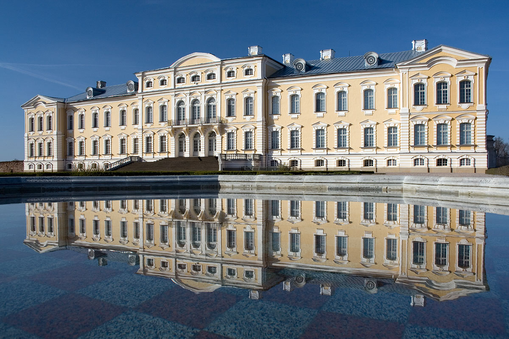
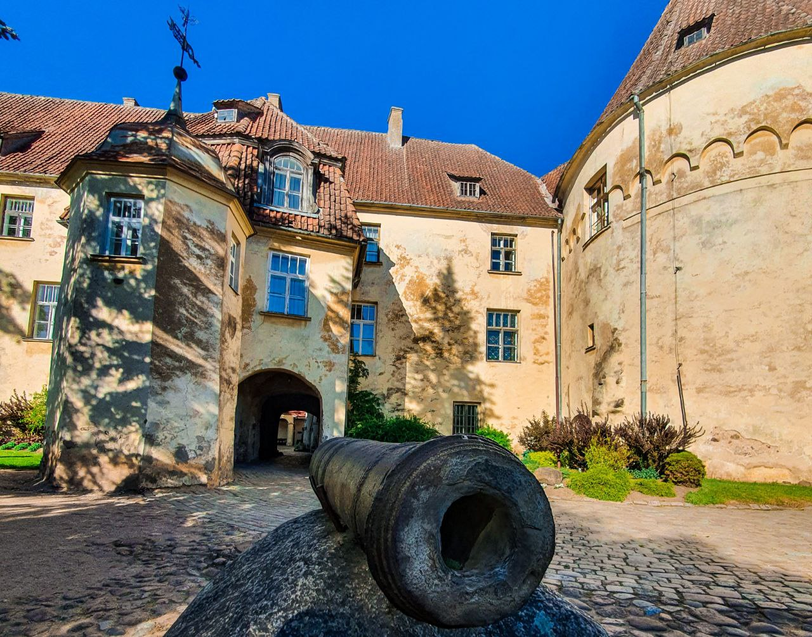
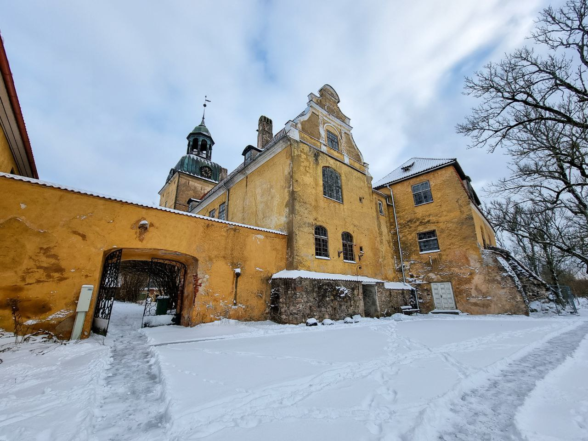

Pilis Latvijā, kā kalni Melnkalnē

1. Cesvaines pils

2. Rundāles pils

3. Stāmerienas pils

4. Jaunmoku pils

5. Cēsu viduslaiku pils

6. Alūksnes Jaunā pils

7. Jaunpils pils

8. Bauskas pils

9. Lielstraupes pils

10. Ēdoles bīskapa pils
