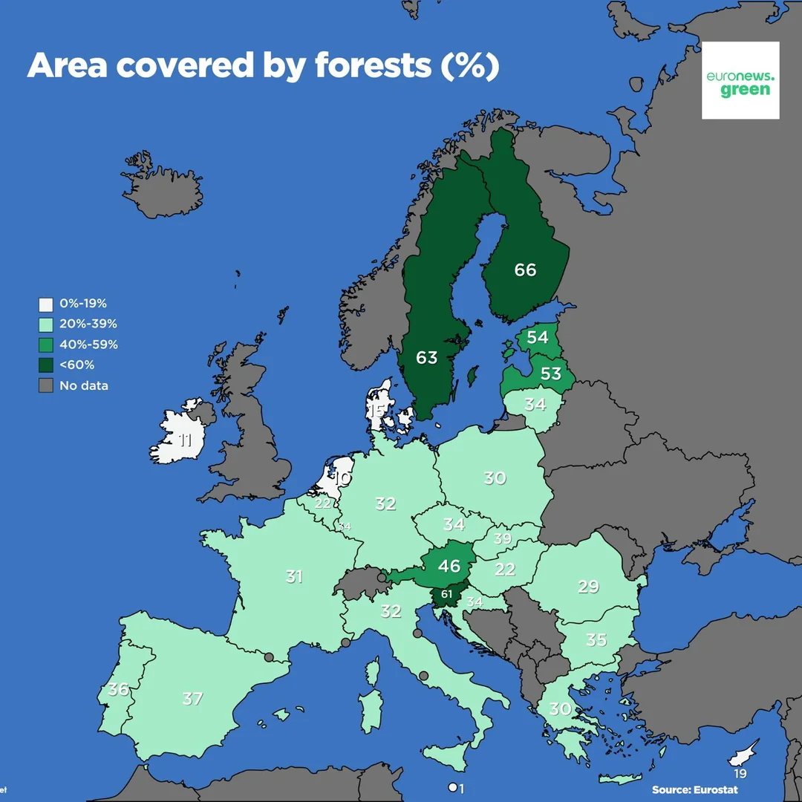

>Latvia is one of the most forested countries in Europe. Forests cover 53% of the country’s territory, which is twice as much as in 1923. The main tree species are conifers, such as pine and spruce, which account for 55% of forested areas. Latvia continues to increase its forested areas, partly thanks to the natural overgrowth of agricultural land.
>
>**AS “Latvijas Valsts Meži” (LVM)**, a state-owned company that manages 1.6 million hectares of forest land, plays a key role in forest resource management. Thousands of hectares of forests are restored annually, which not only maintains ecological balance but also supports the country’s economic growth through forest resource exports. On average, only 69% of the annual growth is harvested, so economically accessible forest resources in Latvia are increasing. This is an important part of the Latvian economy, providing jobs and revenue from timber sales in both domestic and international markets.
>
>In 2018, state forests were restored over an area of 8,800 hectares, with 24.5 million new trees planted, or more than 12 trees per resident of Latvia. In total, 15,200 hectares of state forests were restored over the year.

<iframe width="964" height="534" src="https://ec.europa.eu/eurostat/statistics-explained/index.php?action=statexp-dc-display&title=Forests,_forestry_and_logging" scrolling="no" frameborder="0"></iframe>

