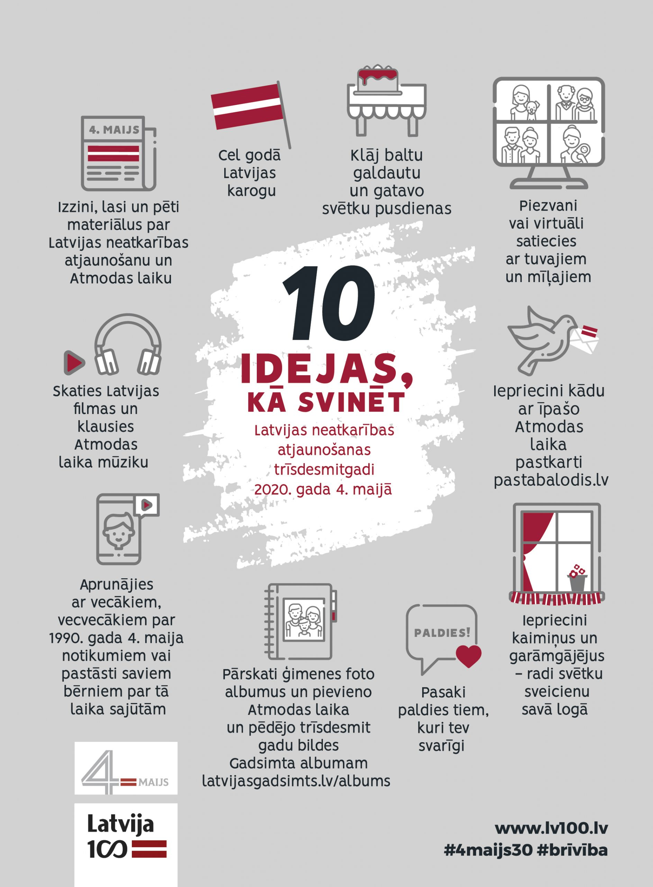
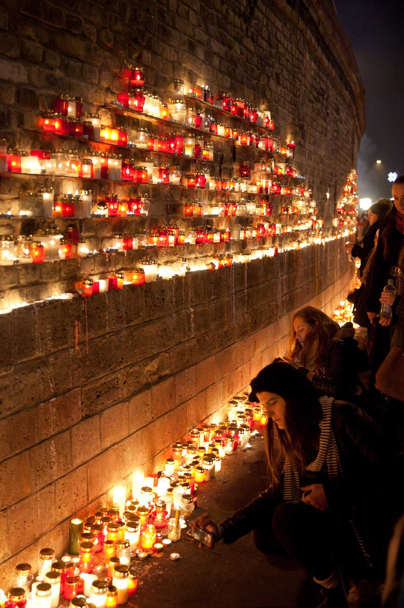

> Ja svētku dienas — 4. maijs, Vispārējo latviešu Dziesmu un deju svētku noslēguma diena un 18. novembris — iekrīt sestdienā vai svētdienā, nākamo darbdienu nosaka par brīvdienu.
# Svētku dienas
## 1.janvāris – Jaungada diena 
## 1.maijs – Latvijas Republikas Satversmes sapulces sasaukšanas diena
- Этот праздник в честь первого заседания Учредительного собрания, 1 мая 1920 года. В течение двух лет с этого собрания был разработан и принят основной закон Латвийкой Республики - Satversmi. Это буквально тот день, когда было положено начало создания Латвийского государства.
Председателем собрания (а в дальнейшем и президентом) был Jānis Čakste, поэтому представители правительства в этот день возлагают цветы к памятнику.

## 4.maijs – Latvijas Republikas Neatkarības atjaunošanas diena
- В этот день проводится торжественное заседание Сейма, отмечая как день принятия Конституции, gan Latvijas valstiskās neatkarības atjaunošanu. Также в этот день вручаются государственные награды, а с 2016 года соблюдается и новая традиция «Baltā galdauta svētkus». Это важный день, некоторые называют 4 мая - вторым день рождением Латвии.

## Maija otrā svētdiena – Mātes diena
## 23.jūnijs – Līgo diena & 24.jūnijs – Jāņu diena (vasaras saulgrieži)
- Cilvēki sapoš dzīvesvietu, vāc jāņuzāles, ticot, ka tām piemīt dziedniecisks spēks, un rotājas ar ziedu vainagiem. Tradicionālais cienasts ir siers un alus. Dziesmās, dejās un lecot pāri ugunskuram, aizvada Jāņu nakti un sagaida saullēktu.

## Vispārējo latviešu Dziesmu un deju svētku noslēguma diena
- Tradicionāls kultūras notikums Latvijā, неотъемлемая часть латышской идентичности, обычно проводится раз в 5 лет, на протяжении недели, собирая тысячи слушателей и зрителей. Dziesma vienmēr ir vijusies cauri latviešu dzīves ritumam. Ne velti Latvija ir «zeme, kas dzied». Mēdz teikt, ka prasme dziedāt un dejot katram latvietim ir ielikta šūpulī 😉

## 18.novembris – Latvijas Republikas proklamēšanas diena
- День рождение Латвии - 106 лет (1918-2024). В этот день проводится торжественное заседание Сейма, вручение государственных наград, военный парад, праздничные концерты, факельные шествия и праздничное обращение Президента.

<iframe width="560" height="315" src="https://www.youtube.com/embed/IpsmLNhjLW8?si=5KZ-IofoEwMxb3ez" title="YouTube video player" frameborder="0" allow="accelerometer; autoplay; clipboard-write; encrypted-media; gyroscope; picture-in-picture; web-share" referrerpolicy="strict-origin-when-cross-origin" allowfullscreen></iframe>

## 24., 25., 26. decembris – Ziemassvētki (ziemas saulgrieži)
## 31.decembris – Vecgada diena

# Latvijas vēstures notikumu atcere
## 20.janvāris – 1991. gada barikāžu aizstāvju atceres diena
- 1991. gada 20. janvāra uzbrukumā tika nošauti pieci un ievainoti 13 cilvēki. Kopumā Padomju Sociālistisko Republiku Savienības (PSRS) varasiestāžu uzbrukumu Latvijas Republikas iestādēm un neatkarības un demokrātijas aizstāvjiem dzīvību zaudēja deviņi Latvijas neatkarības aizstāvji, 318 cilvēki tika atzīti par cietušajiem. Tas kļuva arī par simboliskāko Latvijas tautas nevardarbīgās pretošanās piemēru ceļā uz valstiskās neatkarības atjaunošanu.
## 26.janvāris – Latvijas Republikas starptautiskā (de iure) atzīšanas diena
- Tiek nolikti ziedi pirmā Latvijas Republikas prezidenta Jāņa Čakstes un pirmā ārlietu ministra Zigfrīda Annas Meierovica atdusas vietā Meža kapos, Rīgā.
## 25.marts – Komunistiskā genocīda upuru piemiņas diena
## 14.jūnijs – Komunistiskā genocīda upuru piemiņas diena
- Piemiņas brīdis Rīgas dzelzceļa stacijās “Šķirotava”, “Torņakalns” un citviet Latvijā. Valsts augstākās amatpersonas un politiski represēto biedrību pārstāvji noliek ziedus pie Brīvības pieminekļa. Koncertos tiek atskaņota Lūcijas Garūtas un Andreja Eglīša kantāte “Dievs, Tava zeme deg!”.
## 27.aprīlis (1917) – Latgales kongresa diena
- bija pirmā demokrātiski ievēlētā Latgales latviešu pārstāvju sanāksme, kurā tika nolemts, ka Latgales, Vidzemes un Kurzemes latvieši ir viena tauta un Latgalei jāapvienojas ar pārējiem topošās Latvijas valsts novadiem vienā zemē. Šis notikums ir viens no stūrakmeņiem Latvijas valsts izveidē un latviešu nācijas konsolidācijā.

## 8.maijs – Nacisma sagrāves diena un Otrā pasaules kara upuru piemiņas diena
- Piemiņas brīdis, piedaloties valsts amatpersonām Rīgas Brāļu kapos, Salaspils memoriālā, Lestenes Brāļu kapos un citur.
## 17.jūnijs – Latvijas Republikas okupācijas diena
- Этот памятный день о том, как в ночь на 17 июня 1940 года, войска тоталитарного советского режима внезапно и вероломно напали на Латвию. Вскоре был выдвинут ультиматум, введены оккупационные войска и сменено правительство. С того момента по 21 августа 1991 – Латвия находилась под советской оккупацией, которая сопровождалась репрессиями, насилием и попытками искоренить латышскую идентичность. 
  Мы должны помнить о том, через какую боль и страдания прошли наши предки, чтить их память и ценить самоё дорогое, что у нас есть - свободу.
  _В конце марта 2004 года Латвия стала частью Североатлантического альянса и начала активно развивать военное сотрудничество, обеспечивая тем самым гарантии безопасности. Больше никто не посмеет прийти на нашу землю._
![[Pasted image 20241123150024.png]]

## 22.jūnijs – Varoņu piemiņas diena (Cēsu kaujas atceres diena)
- Atceres pasākumi kritušo karavīru piemiņai Amatā, Priekuļos, Pārgaujā un Cēsīs. Piedalās arī Igaunijas vēstnieks vai kāda no Igaunijas augstākajām valsts amatpersonām.

## 4.jūlijs – Ebreju tautas genocīda upuru piemiņas diena
- Piemiņas brīdis Rīgā 1941. gadā nodedzinātās Horālās sinagogas memoriālā. Notiek ebreju reliģiskās draudzes “Šamir” un Rīgas Geto muzeja organizētais “Dzīvo gājiens”.
## 11.augusts – Latvijas brīvības cīnītāju piemiņas diena
## 21.augusts – Konstitucionālā likuma «Par Latvijas Republikas valstisko statusu» pieņemšanas diena
- Apaļās gadadienās tiek atzīmēts ar ekumenisko dievkalpojumu Doma baznīcā, svētku koncertu, ziedu nolikšanu pie Brīvības pieminekļa.
## 23.augusts – staļinisma un nacisma upuru atceres diena
- Atcere saistīta ar 1989. gada nevardarbīgās pretošanās akciju «Baltijas ceļš». Piemēram, 2009. gadā notika diennakts skrējiens «Sirdspuksti Baltijai» pa vēsturisko Baltijas ceļa maršrutu.
## 11.novembris – Lāčplēša diena
- Valsts apbalvojumu pasniegšana. Rīgas krastmalā un Brāļu kapos tiek aizdegtas svecītes Latvijas aizstāvju piemiņai. Citviet Latvijā ar svecēm izgaismo pieminekļus Latvijas brīvības cīnītājiem. Lāpu gājiens.
- Nosaukumā ietvertais vārds «Lāčplēsis» ir atsauce uz Andreja Pumpura tautas teikās balstītā eposa “Lāčplēsis” (1888) galveno varoni un Raiņa lugu «Uguns un nakts». Lāčplēsim piemita pārdabisks spēks un varonība, kas izpaužas arī dzimtenes aizstāvēšanā pret iebrucējiem.

## Decembra pirmā svētdiena – pret latviešu tautu vērstā totalitārā komunistiskā režīma genocīda upuru piemiņas diena
- Хотя чётких правил нету
# Sabiedrības grupu godināšana un vērtību izcelšana
## 9.maijs – Eiropas diena
## 15.maijs – Starptautiskā ģimenes diena
## 1.jūnijs – Starptautiskā bērnu aizsardzības diena
## Septembra otrā svētdiena – Tēva diena
## 1.oktobris – Starptautiskā senioru diena
## 1.septembris – Zinību diena
## 22.septembris – Baltu vienības diena
# Profesiju svētki
## 17.maijs – Ugunsdzēsēju un glābēju diena
## Jūnija trešā svētdiena – Medicīnas darbinieku diena
## Jūlija otrā sestdiena – Jūras svētku diena
## Oktobra pirmā svētdiena – Skolotāju diena
## 7.novembris – Robežsargu diena
## 5.decembris – Policijas darbinieku diena

